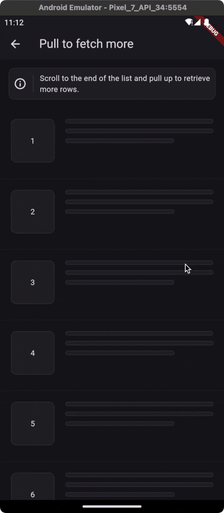
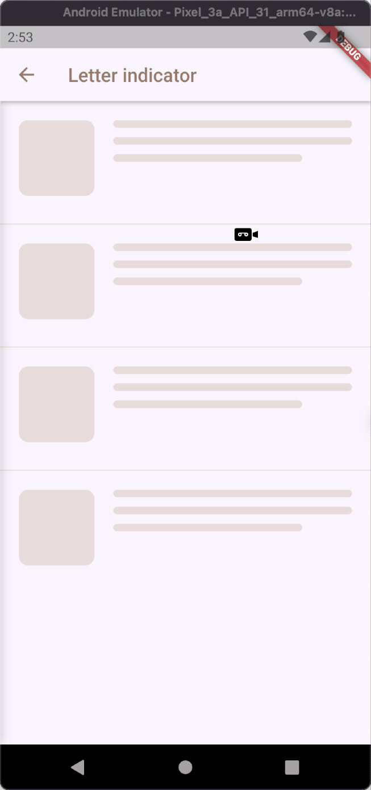
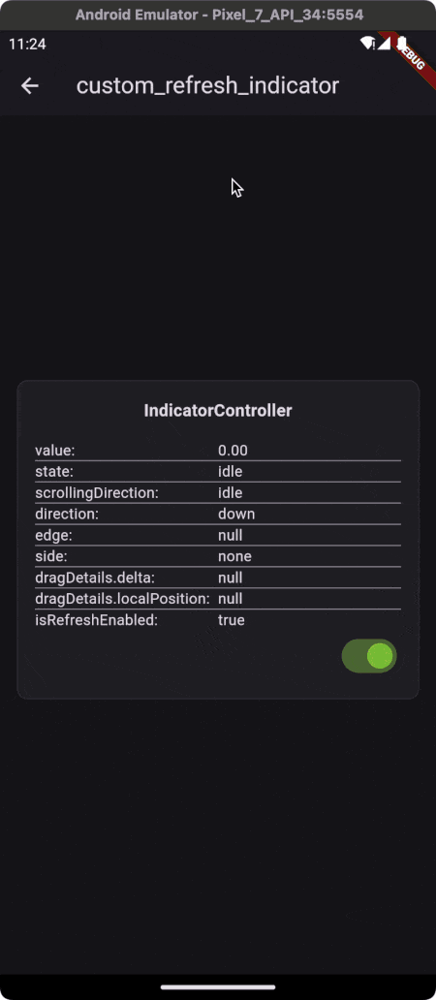

# Flutter Custom Refresh Indicator

[](https://github.com/gonuit/flutter-custom-refresh-indicator/actions/workflows/test.yml)

A flutter package that allows you to easily create a custom refresh indicator widget.

### **TLDR; [ONLINE DEMO](https://custom-refresh-indicator.klyta.it)**!

---

# QUICK START

```dart
CustomRefreshIndicator(
  /// Scrollable widget
  child: ListView.separated(
    itemBuilder: (BuildContext context, int index) => const SizedBox(
      height: 100,
    ),
    separatorBuilder: (BuildContext context, int index) =>
        const SizedBox(height: 20),
  ),
  /// Custom indicator builder function
  builder: (
    BuildContext context,
    Widget child,
    IndicatorController controller,
    ) {
      /// TODO: Implement your own refresh indicator
      return Stack(
        children: <Widget>[
          AnimatedBuilder(
            animation: controller,
            builder: (BuildContext context, _) {
              /// This part will be rebuild on every controller change
              return MyIndicator();
            },
          ),
          /// Scrollable widget that was provided as [child] argument
          ///
          /// TIP:
          /// You can also wrap [child] with [Transform] widget to also a animate list transform (see example app)
          child,
        ],
      );
    }
  /// A function that's called when the user has dragged the refresh indicator
  /// far enough to demonstrate that they want the app to refresh.
  /// Should return [Future].
  onRefresh: myAsyncRefreshMethod,
)
```

# Examples

Almost all of these examples are available in the example application.

| Plane indicator [[SOURCE](example/lib/indicators/plane_indicator.dart)][[DEMO](https://custom-refresh-indicator.klyta.it/#/plane)] | Ice cream [[SOURCE](example/lib/indicators/ice_cream_indicator.dart)][[DEMO](https://custom-refresh-indicator.klyta.it/#/ice-cream)] | Warp [[SOURCE](example/lib/indicators/warp_indicator.dart)][[DEMO](https://custom-refresh-indicator.klyta.it/#/warp)] |
| :--------------------------------------------------------------------------------------------------------------------------------: | :----------------------------------------------------------------------------------------------------------------------------------: | :-------------------------------------------------------------------------------------------------------------------: |
|                                                                                      |                                                                                |                                                                           |

| With complete state [[SOURCE](example/lib/indicators/check_mark_indicator.dart)][[DEMO](https://custom-refresh-indicator.klyta.it/#/check-mark)] | Pull to fetch more [[SOURCE](example/lib/indicators/swipe_action.dart)][[DEMO](https://custom-refresh-indicator.klyta.it/#/fetch-more)] | Envelope [[SOURCE](example/lib/indicators/envelop_indicator.dart)][[DEMO](https://custom-refresh-indicator.klyta.it/#/envelop-indicator)] |
| :----------------------------------------------------------------------------------------------------------------------------------------------: | :-------------------------------------------------------------------------------------------------------------------------------------: | :---------------------------------------------------------------------------------------------------------------------------------------: |
|                                                                        |                                                                                                     |                                                                                         |

| Programmatically controlled [[SOURCE](example/lib/screens/programmatically_controlled_indicator_screen.dart)][[DEMO](https://custom-refresh-indicator.klyta.it/#/programmatically-controlled)] |                                                                 Your indicator                                                                  |                                                                 Your indicator                                                                  |
| :--------------------------------------------------------------------------------------------------------------------------------------------------------------------------------------------: | :---------------------------------------------------------------------------------------------------------------------------------------------: | :---------------------------------------------------------------------------------------------------------------------------------------------: |
|                                                                                                                          | Have you created a fancy refresh indicator? This place is for you. [Open PR](https://github.com/gonuit/flutter-custom-refresh-indicator/pulls). | Have you created a fancy refresh indicator? This place is for you. [Open PR](https://github.com/gonuit/flutter-custom-refresh-indicator/pulls). |

# Documentation

## CustomRefreshIndicator widget

The _CustomRefreshIndicator_ widget provides an absolute minimum functionality that allows you to create and set your own custom indicators.

### onStateChanged

The _onStateChanged_ callback is called everytime _IndicatorState_ has been changed.  
This is a convenient place for tracking indicator state changes. For a reference take a look at the [example check mark indicator widget](example/lib/indicators/check_mark_indicator.dart).

Example usage:

```dart
CustomRefreshIndicator(
  onRefresh: onRefresh,
  // You can track state changes here.
  onStateChanged: (IndicatorStateChange change) {
    if (change.didChange(from: IndicatorState.dragging, to: IndicatorState.armed)) {
      // Do something...
    } else if(change.didChange(to: IndicatorState.idle)) {
      // Do something...
    }
    // And so on...
  }
  // ...
)
```

## IndicatorController

### Controller state and value changes.

The best way to understand how the _CustomRefreshIndicator_ widget changes its controller data is to see the example 😉. An example is available in the example application.



| state        | value   | value description                                                                                       | Description                                                                                                                                                                                                                              |
| ------------ | :------ | :------------------------------------------------------------------------------------------------------ | :--------------------------------------------------------------------------------------------------------------------------------------------------------------------------------------------------------------------------------------- |
| **idle**     | `==0.0` | Value eqals `0.0`.                                                                                      | No user action.                                                                                                                                                                                                                          |
| **dragging** | `=<0.0` | Value is eqal `0.0` or larger but lower than `1.0`.                                                     | User is dragging the indicator.                                                                                                                                                                                                          |
| **armed**    | `>=1.0` | Value is larger than `1.0`.                                                                             | User dragged the indicator further than the distance declared by `extentPercentageToArmed` or `offsetToArmed`. User still keeps the finger on the screen.                                                                                |
| **loading**  | `>=1.0` | Value decreses from last `armed` state value in duration of `armedToLoadingDuration` argument to `1.0`. | User finished dragging (took his finger off the screen), when state was equal to `armed`. `onRefresh` function is called.                                                                                                                |
| **hiding**   | `<=1.0` | Value decreses in duration of `draggingToIdleDuration` or `loadingToIdleDuration` arguments to `0.0`.   | Indicator is hiding after:<br />- User ended dragging when indicator was in `dragging` state.<br />- Future returned from `onRefresh` function is resolved.<br />- Complete state ended.<br />- User started scrolling through the list. |
| **complete** | `==1.0` | Value equals `1.0` for duration of `completeStateDuration` argument.                                    | **This state is OPTIONAL, provide `completeStateDuration` argument with non null value to enable it.**<br /> Loading is completed.                                                                                                       |

---

### Support

If you like this package, you have learned something from it, or you just don't know what to do with your money 😅 just buy me a cup of coffee ☕️ and this dose of caffeine will put a smile on my face which in turn will help me improve this package. Also as a thank you, you will be mentioned in this readme as a sponsor.

<div align="center">
<a href="https://www.buymeacoffee.com/kamilklyta" target="_blank"></a>
</div>
<p align="center">Have a nice day! 👋</p>
